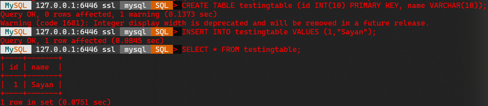
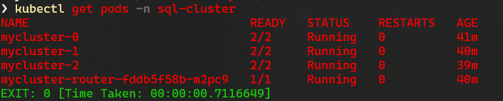

# Resilient and Scalable SQL Database using Digital Ocean Kubernetes

by Sayan K.

- **Objective:**  
  Deploy a SQL database cluster which will be redundant and scalable. This walkthough uses the [MySQL Operator for Kubernetes](https://github.com/mysql/mysql-operator) to create a [InnoDB](https://dev.mysql.com/doc/refman/8.0/en/innodb-storage-engine.html) DB Cluster.   All code is Run on [Powershell Core v7.0.3](https://github.com/PowerShell/PowerShell/releases/tag/v7.0.3) on Windows 10 Version 21H1 Build 19043.1415

- **Requirements:**
  - **Digital Ocean account** for using their Kubernetes services | [Official Site](https://www.digitalocean.com/products/kubernetes/)
  - **kubectl v1.21.5** as the lastest version supported by DO is v1.21.5 and our client needs to be within 1 minor release of DO's version. | [Official Site](https://kubernetes.io/docs/tasks/tools/) | [Direct Download v1.21.5](https://storage.googleapis.com/kubernetes-release/release/v1.21.5/bin/windows/amd64/kubectl.exe)
  - **helm v3.7.2** or latest. I used v3.7.2, but this should work in later versions too, but beware older versions might cause issues (as I faced). | [Official Site](https://helm.sh/) | [Direct Download v3.7.2](https://get.helm.sh/helm-v3.7.2-windows-amd64.zip)
  - Any **Text Editor**. I use [Visual Studio Code](https://code.visualstudio.com/). Version doesn't matter, you can even use notepad.
  - Some **MySQL client** to connect to the MySQL Cluster. I use [MySQL Shell](https://dev.mysql.com/doc/mysql-shell/8.0/en/mysqlsh.html)
  - Have **Droplet Limit** set to **minimum 3** and **Volume limit** set to **minimum 5**. Node Limit 1 might work, but Volume limit 1 won't work in our case.


## Section 1. Setting up Kubernetes on DigitalOcean

1. Login to your DigitalOcean Account and head over to [Kubernetes on your dashboard](https://cloud.digitalocean.com/kubernetes/clusters) and Click on **Create a Kubernetes Cluster**.
2. Setup the Cluster as follows:
   - Kubernetes Version: You should always select the **recommended version**, but this walthough is done on *1.21.5-do.0*.
   - Datacenter Region: Choose the one **closest to you**. I Chose *BLR1*
   - VPC Network: **Default**
   - Cluster Capacity:
     - Node Pool Name: Leave it as is.
     - Machine Type: Basic Nodes
     - Node plan: **$20/month per node (2.5GB RAM Usable / 2 vCPUs)** | If you choose lower, you might suffer from issues like "Node is not ready" during cluster rollout.
     - Node count: 3
   - Finalize:
      - Name: Choose **anything you want**, I'm going with `k8-challenge-cluster`
      - Project: Select your project you want the cluster in
      - Tags: Optional, if you fancy.

    Click on **Create Cluster**
3. You will be on a page like this:  
     
   *You can ignore the Getting Started guide for now, hit on the X next to it to close the guide.*  
   Head over to the **Nodes tab**, and expand the pool you have.  
   You will see something like this:  
     
   You can now safely grab a coffee and wait for the nodes to get provisioned. PS: It might take a while.  
   Wait till the dashboard looks like this:  
     
   Now, Head over to the **Overview tab** and **Download Config File**.  
   It will be named like `<Name you chose in Section 1 Step 2 Finalize Step>-kubeconfig.yaml`. We need this for our kubectl to communicate with the cluster.
4. Now, we can use the kubeconfig.yaml file in multiple ways:
   - You can put it under **$HOME/.kube/config** *(Lowest Priority)*
   - You can use the **`KUBECONFIG`** Environment Variable to store a link to the kubeconfig.yaml file *(Medium Priority)*
   - You can use **`--kubeconfig <kubeconfig.yaml file>`** flag with each of your kubectl commands *(Highest Priority)*

    More information [here](https://kubernetes.io/docs/concepts/configuration/organize-cluster-access-kubeconfig/)  
    For this walthrough, we will be using the `KUBECONFIG` Environment Variable for the Current Terminal Session only.  
    To do that, we need to run:

    ```powershell
    $Env:KUBECONFIG="D:\Downloads\k8-challenge-cluster-kubeconfig.yaml"
    ```

    **Replace `D:\Downloads\k8-challenge-cluster-kubeconfig.yaml` with your kubeconfig.yaml file name with directory.**  
    What this will do is, store the kubeconfig.yaml file as the config for kubectl for the current terminal session, meaning, if you close your terminal or open a new one, you will need to run this command once again in that.  
    Now, let us check if your connection is good. Command is:
    ```powershell
    kubectl get nodes
    ```
    You will see something like this:  
      
    Don't worry if your AGE is different than mine.  
      
    Now that our kubectl is ready, we can proceed with installing the MySQL Operator and the InnoDB Cluster.

## Section 2. Installing MySQL Operator and InnoDB

1. Clone the official MySQL Operator Repository
   ```bash
   git clone https://github.com/mysql/mysql-operator.git
   ```  
     
   Enter the directory
   ```bash
   cd mysql-operator
   ```
   Install the operator using helm
   ```bash
   helm install mysql-operator helm/mysql-operator --namespace mysql-operator --create-namespace
   ```  
     
2. Then we need to create a namespace for our cluster.
   ```bash
   kubectl create namespace sql-cluster
   ```
   Next, we need to create a secret to store our root password.
   ```bash
   kubectl create secret generic mypwds --from-literal=rootUser=root --from-literal=rootHost=%         --from-literal=rootPassword="yourPasswordHere" --namespace sql-cluster
   ```  
      
    Replace `yourPasswordHere` with the password you want.
3. Now, we need to make a cluster defintion file like [dbconfig.yaml](dbconfig.yaml) having content:
   ```yaml
   apiVersion: mysql.oracle.com/v2alpha1
   kind: InnoDBCluster
   metadata:
     name: mycluster
     namespace: sql-cluster
   spec:
     secretName: mypwds
     instances: 3
     router:
       instances: 1
    
    ```
    Here, secretName points to the secret we created in the previous step, i.e `mypwds`. The instances under spec can be used to scale the cluster. We are starting with 3 instances.
4. Apply the definition.
    ```bash
    kubectl apply -f dbconfig.yaml
    ```  
      
    Now, we observe the deployment with
    ```bash
    kubectl get innodbcluster --watch  --namespace sql-cluster
    ```  
      
    You can also watch it on the *Kubernetes Dashboard*, which you can access from the *DigitalOcean Dashboard* from Section 1 Step 3. It might take a while for all the instances to spin up, so again, you can grab another coffee! Once you see **all 3 Online**, press **Ctrl+C** to stop watching.

    And that's it, you have deployed the InnoDB MySQL Cluster Successfully! In the next step, we will connect to it and do some operations.

## Section 3. Connecting to the MySQL DB Cluster

1. The MySQL cluster can be accessed through a service. To know about the service, run
    ```bash
    kubectl get service mycluster  --namespace sql-cluster
    ```  
      
    We see that our cluster service has a cluster IP of `10.245.90.34`, but we cannot use this IP itself to access the MySQL server. We need to describe this service to get to know the details about the MySQL server.
    ```bash
    kubectl describe service mycluster  --namespace sql-cluster
    ```  
      
    Woaaa! That's a lot of text, right? Well, we just need to look for the TargetPort and Endpoints of the mysql section. In our example, we see that the mysql server runs on port `6446` and on IP `10.244.0.64`. If you try to connect to this Endpoint of `10.244.0.64:6446`, you still will not be able to reach the MySQL server as the server currenly is visible only inside the cluster. To make it visible outside, we need to forward the ports.
    ```bash
    kubectl port-forward service/mycluster mysql  --namespace sql-cluster
    ```  
      
    Now, hang on if it seems stuck, it's meant to be like that only. 

2. Now, we will use our mysql client to connect to the server. PS: Server will be available on localhost at `127.0.0.1`.  
    In this example I will use `mysqlsh` to connect.  
    In a new terminal, enter the following:
    ```bash
    mysqlsh --user=root --port=6446 --host 127.0.0.1
    ```
    It will ask for the password. Enter the root password you created in Section 2 Step 2.  
      
    See how I changed the mode from `JS` to `SQL` and also selected the `mysql` schema. Now, let us enter some data:
    ```sql
    CREATE TABLE testingtable (id INT(10) PRIMARY KEY, name VARCHAR(10));

    INSERT INTO testingtable VALUES (1,"Sayan");

    SELECT * FROM testingtable;
    ```  
      
    Ah great! We got a SQL Database, but hey! I said something about being resilient and scalable, right? Let's explore those in the next section!

## Section 4. Exploring Resilience and Scalability

   - **Resilience:**

      In order to be resilient, the DB Cluster must be ready to handle if any pod fails. So, first, let us check out which host we are currenly connected to in the MySQL Cluster. Run this in the MySQL Shell:
      ```sql
      SHOW VARIABLES WHERE Variable_name = 'hostname';
      ```  
        
      Oh! So seems like, `mycluster-0` is handling our connection now. Let us simulate a pod failure and take down this pod. Then we will see what happens!  
      Open another new terminal, and set the environment variable once again like in Section 1 Step 4.  
      Let us check the pods once:
      ```bash
      kubectl get pods
      ```  
        
       Oh, so `mycluster-0` is running, let's terminate it with the following:
      ```bash
      kubectl delete -n sql-cluster pod mycluster-0
      ```
      Please note, during section 4 procedures, leave the other two terminals (one with the port forwarding active, you will see some stuff like `Handling connection for 6446`, don't worry, that's normal; and the other with the mysql shell running) untouched unless mentioned to work in those. Do not close those or interrupt them.  
        
      Please Note: It might freeze after saying that pod has been deleted, like it did with me, if that's the case, just wait for a few seconds before hitting Ctrl+C (that's why the weird exit code)  
      Now, let's switch back to the MySQL Shell and check which host we are now connected to!  
        
      Woaa! See that? Since the `mycluster-0` went down, we connected to `mycluster-2` automatically. Now, let's check if our data still remains:  
        
      Voila! Our data is still there! So, one pod went down, then another pod took over but our data is still there.  
      There you go, Resilience Achieved :white_check_mark:

   - **Scalability:**

      In order to scale the cluster, we can just change the number of instances in our [dbconfig.yaml](dbconfig.yaml). Initially, we had a cluster of 3, now, let us scale up to 4. 
      ```yaml
      apiVersion: mysql.oracle.com/v2alpha1
      kind: InnoDBCluster
      metadata:
        name: mycluster
        namespace: sql-cluster
      spec:
        secretName: mypwds
        instances: 4
        router:
          instances: 1

      ```
      Switch to the 2nd terminal connected to the kubernetes cluster (the one not running the port forward) and apply the change with:
      ```bash
      kubectl apply -f dbconfig.yaml
      ```
      And observe the scaling with:
      ```bash
      kubectl get innodbcluster --watch  --namespace sql-cluster
      ```  
        
      See that? It spun up a new pod. You can Ctrl+C to stop watching.  
      Now, let us downscale the cluster to, let's say, 2 instances.
      ```yaml
      apiVersion: mysql.oracle.com/v2alpha1
      kind: InnoDBCluster
      metadata:
        name: mycluster
        namespace: sql-cluster
      spec:
        secretName: mypwds
        instances: 2
        router:
          instances: 1

      ```
      Again, apply with:
      ```bash
      kubectl apply -f dbconfig.yaml
      ```
      And observe the scaling with:
      ```bash
      kubectl get innodbcluster --watch  --namespace sql-cluster
      ```  
        
      Let us confirm with `kubectl get pods`  
        
      And yes, there are only 2 pods.  
      > Note: These changes in pods can also be observed on the Kubernetes Dashboard on the Pods Panel

      But wait a minute, what happened to our data?  
      Well, since we still have that MySQL Shell open, let us check if that data is still there or not.  
        
      Of course our data is still there! And we are connected to a new host now too!  
      So, putting a check mark next to Scalability too :white_check_mark: